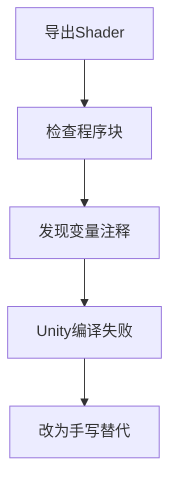

# USCSandbox Shader 编译失败复盘

## 背景

之前按静态结构把 71 个 Shader 标记为“可用候选”，依据是它们包含 `CGPROGRAM`、`#pragma vertex`、`#pragma fragment` 和函数体。实际复制到 Unity 工程后，`BlobLight.shader` 等文件出现编译错误。

本次复盘结论是：这个判断标准过宽。USCSandbox 生成的这 71 个文件不是完整 Unity 可编译源码，而是带有 DXBC 反编译痕迹的伪 HLSL。

## 根因

USCSandbox 把常量缓冲区中的部分变量输出成了注释，但函数体仍在使用这些变量。Unity 编译时不会从注释里生成变量声明，因此出现 `undeclared identifier`。

典型证据：

```hlsl
// float _BlobPower; // 20 (starting at cb2[1].y)
tmp0.x = tmp0.x * _BlobPower;
```

```hlsl
// float2 Vector2_CBB4F399; // 32 (starting at cb1[2].x)
tmp0 = _TimeParameters * Vector2_CBB4F399.xyxy + inp.interp1.yyyy;
```

另外还有 Unity 内置变量被重复声明的问题：

```hlsl
float4 unity_OrthoParams;
```

这会和 Unity 自己注入的内置变量冲突，导致 `redefinition`。

## Unity 日志证据

从 `C:\Users\MLTZ\AppData\Local\Unity\Editor\Editor.log` 抽取到的 Shader 编译错误：

| Shader | 唯一文件数 | 错误 |
| --- | ---: | --- |
| `Shader Graphs/Slash_AB_Slashfx` | 32 | `undeclared identifier 'Vector2_CBB4F399'` |
| `Shader Graphs/Slash_Slashfx` | 31 | `undeclared identifier 'Vector2_CBB4F399'` |
| `Shader Graphs/Fx_dissolve_particle_apb` | 6 | `redefinition of 'unity_OrthoParams'` |
| `Shader Graphs/BlobLight` | 1 | `undeclared identifier '_BlobPower'` |
| `Shader Graphs/BlobShadow` | 1 | `undeclared identifier '_BlobPower'` |

这正好覆盖之前标记为“可用候选”的 71 个文件。

## 严格扫描结果

重新扫描当前 Shader 目录：

`D:\CrackALL\灰烬之国\破解资源1\CinderiaFix\Assets\Shaders`

| 分类 | 数量 | 说明 |
| --- | ---: | --- |
| 空壳不可编译 | 172 | 有 Pass 但没有 CG 或 HLSL 程序块 |
| 有程序但疑似不可编译 | 71 | 有程序块，但命中常量缓冲变量注释化等缺陷 |
| 可确认可编译 | 0 | 本轮没有证据支持 |
| 总数 | 243 | 当前目录下所有 `.shader` 文件 |

明细 CSV：

`D:\CrackALL\AssetRipper\Docs\ShaderDecompileScan\cinderia_shader_unity_compile_error_evidence.csv`

## 结论修正

之前的“可用候选”只能表示“文件内存在程序体”，不能表示“Unity 能编译”。结合 Unity 日志后，当前应修正为：

- 172 个为空壳，不可直接使用。
- 71 个有程序体，但实际编译失败或高度疑似编译失败。
- 目前没有一个 USCSandbox 导出的 Shader 可以确认作为完整可用 Shader。

## 类比理解

空壳 Shader 像是只有目录和章节标题的书，没有正文。

这 71 个有程序体的 Shader 像是有正文草稿，但里面很多关键名词只写在批注里，正文引用时却没有正式定义。读者能大概理解意思，编译器却无法通过。

## 后续建议

1. 不再把 `CGPROGRAM` 存在当作可用标准，必须以 Unity 编译通过为准。
2. 如果要修 USCSandbox，需要处理常量缓冲区变量恢复、Unity 内置变量过滤、DXBC 矩阵字段访问转换、伪类型转换等问题。
3. 如果目标是尽快让项目跑起来，建议不要继续尝试直接使用这些反编译 Shader，而是为关键 Shader 手写替代版本。
4. 优先替代 `_URP/人物Spine`、Blob、Slash、Dissolve 这几类游戏内可见效果，反编译结果只作为参数和算法线索。



## 引用说明

- Unity Manual: Writing HLSL shader programs
  https://docs.unity3d.com/Manual/SL-ShaderPrograms.html
- Unity Manual: ShaderLab Pass
  https://docs.unity3d.com/Manual/SL-Pass.html
- Unity Manual: ShaderLab built in shader variables
  https://docs.unity3d.com/Manual/SL-UnityShaderVariables.html
- Unity Manual: Shader compile errors and shader variants
  https://docs.unity3d.com/Manual/shader-branching.html
