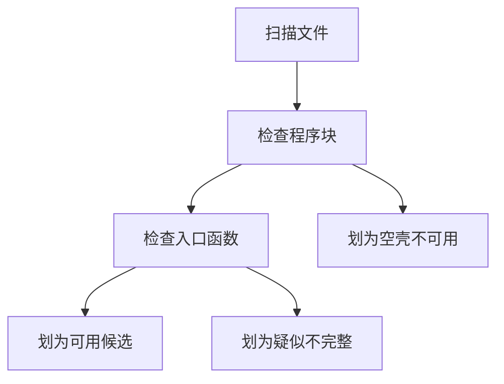

# USCSandbox Shader反编译不完整注意事项

## 问题结论

USCSandbox 对 Cinderia 的 Shader 反编译结果不能简单按“生成文件成功”判断为“完整可用”。当前已确认存在一类 Shader 只恢复了 ShaderLab 外壳，没有恢复实际的 CG 或 HLSL 程序体。

典型例子：

- 文件：`D:\CrackALL\灰烬之国\破解资源1\CinderiaFix\Assets\Shaders\_URP_人物Spine.shader`
- Shader 名称：`_URP/人物Spine`
- 现象：有 `Properties`、`SubShader`、`Pass`、`Tags`、`Blend`、`Cull` 等结构，但没有 `CGPROGRAM`、`HLSLPROGRAM`、`#pragma vertex`、`#pragma fragment`、`vert`、`frag` 等实际程序入口。

## 影响

这类 Shader 只能看出原始材质的参数和渲染管线结构，不能看出真正的颜色计算、特效计算和采样逻辑。直接放入 Unity 后，通常不能还原原游戏效果，部分情况下还可能编译失败或显示 fallback 错误效果。

类比理解：这类文件像是菜谱的目录和食材清单还在，但烹饪步骤缺失了。我们能知道它想做人物 Spine、冰冻、石化、霸体、隐身、水下等效果，但不知道具体怎么计算这些效果。

## 初步判定标准

本次先采用静态扫描标准：

- 可用候选：包含 `CGPROGRAM` 或 `HLSLPROGRAM`，并且有 `#pragma vertex`、`#pragma fragment` 和函数形态代码。
- 空壳不可用：有 `Pass`，但没有 `CGPROGRAM` 或 `HLSLPROGRAM` 程序块。
- 疑似不完整：有程序块，但入口 pragma 或函数形态不完整。
- 不可用：包含已知失败标记，或既没有 Pass 也没有程序块。

## 当前证据

已扫描 Unity 项目当前 Shader 目录：

`D:\CrackALL\灰烬之国\破解资源1\CinderiaFix\Assets\Shaders`

扫描结果：

| 分类 | 文件数 | 说明 |
| --- | ---: | --- |
| 可用候选 | 71 | 静态结构上包含程序块和顶点片元入口 |
| 空壳不可用 | 172 | 只有 ShaderLab 外壳，没有实际程序体 |
| 疑似不完整 | 0 | 本轮未发现 |
| 不可用 | 0 | 本轮未发现已知失败标记 |
| 总数 | 243 | 当前目录下所有 `.shader` 文件 |

重点风险：

- `_URP/人物Spine` 共 128 个文件，全部为空壳不可用。
- `_URP/人物Spine_无阴影` 也是空壳不可用，暂时不能作为可移植参考。
- `_URP/环境/默认`、`_URP/扭曲`、`_URP/特殊效果_黑白` 等也属于空壳不可用。

## 编译失败补充

后续把 71 个“有程序体候选”放入 Unity 工程测试后，发现它们也不能直接视为可用。Unity 日志显示：

- `Shader Graphs/Slash_AB_Slashfx` 和 `Shader Graphs/Slash_Slashfx` 缺少 `Vector2_CBB4F399` 声明。
- `Shader Graphs/BlobLight` 和 `Shader Graphs/BlobShadow` 缺少 `_BlobPower` 声明。
- `Shader Graphs/Fx_dissolve_particle_apb` 重复声明 `unity_OrthoParams`。

这些问题的共同根因是：USCSandbox 把常量缓冲区变量输出成了注释，或把 Unity 内置变量当作普通变量重复声明。也就是说，存在程序体不等于 Unity 可编译。

## 后续建议

1. 对“可用候选”执行 Unity 导入和编译验证，确认是否真的可编译。
2. 对“空壳不可用”的核心 Shader 优先手写替代版本，尤其是 `_URP/人物Spine`。
3. 不要把 USCSandbox 的“生成文件成功”作为移植成功标准，必须增加“是否包含程序体”和“Unity 是否编译通过”两个检查。
4. 后续如果改 USCSandbox，应优先调试为什么这些 Shader 的 Pass 没有写出程序体，例如目标平台子程序是否未匹配、Shader Graph 生成代码是否丢失、或 ProgramMask 是否没有进入导出路径。

## 引用说明

- Unity Manual: Writing HLSL shader programs
  https://docs.unity3d.com/Manual/SL-ShaderPrograms.html
- Unity Manual: Pass block in ShaderLab reference
  https://docs.unity3d.com/Manual/SL-Pass.html
- Unity Manual: HLSL pragma directives reference
  https://docs.unity3d.com/Manual/SL-PragmaDirectives.html
- Unity Manual: Fallback block in ShaderLab reference
  https://docs.unity3d.com/Manual/SL-Fallback.html
