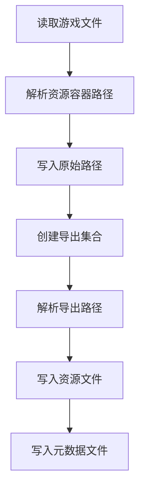

# 保持源资源目录结构导出设计方案

## 背景

当前 AssetRipper 已经有源路径概念，核心字段在 `IUnityObjectBase` 中：

- `OriginalPath`
- `OriginalDirectory`
- `OriginalName`
- `OriginalExtension`
- `OverridePath`
- `OverrideDirectory`
- `OverrideName`
- `OverrideExtension`

`OriginalPathProcessor` 会从 `ResourceManager.Container` 和 `AssetBundle.Container` 读取 Unity 资源容器路径，并写入资产的 `OriginalPath`。但是导出阶段主要使用 `Asset.GetBestDirectory()` 和 `Asset.GetBestName()` 重新组织目录和文件名，扩展名也通常由具体导出器决定，所以导出结果可能不完全保留 AssetBundle 或 ResourceManager 中记录的资源路径。

可以类比为：游戏包里每个资源原本有一张快递面单，面单上写着原来的收货地址；现在导出时会把资源按类型重新放到不同货架。我们要做的是新增一种导出方式，让程序优先按面单地址摆放资源，而不是按货架分类重排。

## 目标

新增一个保持资源容器路径的导出策略，优先使用 `m_Container` 对应的路径导出资源，例如保持类似 `Assets/Art/Characters/Hero.png` 的目录结构。

本方案优先实现类似 AssetStudio 的 `ByContainer` 行为：

- 有容器路径时，按容器路径的目录部分导出。
- 容器路径包含文件名时，文件名优先使用容器路径中的文件名。
- 没有容器路径时，回退到现有 AssetRipper 导出逻辑。
- 默认行为不改变，避免影响现有用户。

## 不做的内容

- 不按游戏磁盘文件来源路径分组，例如 `Cinderia_Data` 下的物理文件路径。
- 不重写所有导出器的内容转换逻辑。
- 不保证所有没有 `m_Container` 记录的资源都能还原原始 Unity 工程路径。
- 不改变 `.meta` 的 GUID 生成策略。

## 现有证据

AssetRipper 当前已有路径采集：

- `Source/AssetRipper.Processing/Scenes/OriginalPathProcessor.cs`
  - `ResourceManager.Container` 会写入 `asset.OriginalPath`。
  - `AssetBundle.Container` 会写入 `asset.OriginalPath`。
  - `BundledAssetsExportMode.DirectExport` 已经会尽量写成 `Assets/...`。

AssetRipper 当前导出落盘：

- `Source/AssetRipper.Export.UnityProjects/AssetExportCollection.cs`
  - 导出目录来自 `Asset.GetBestDirectory()`。
  - 导出文件名来自 `GetUniqueFileName()`，内部使用 `asset.GetBestName()` 和导出器扩展名。
- `Source/AssetRipper.Export.UnityProjects/ExportCollection.cs`
  - 扩展名由 `GetExportExtension()` 或子类覆盖。

AssetStudio 可参考实现：

- `D:\CrackALL\assetstudio\AssetStudio.CLI\Studio.cs`
  - `AssetGroupOption.ByContainer` 会优先使用 `asset.Container`。
  - 如果 `Container` 有扩展名，则使用 `Path.GetDirectoryName(asset.Container)` 作为目录。
  - 没有 `Container` 时回退到类型目录。
- `D:\CrackALL\assetstudio\AssetStudio.GUI\AssetBrowser.cs`
  - 从 `AssetBundle.m_Container` 和 `ResourceManager.m_Container` 收集容器路径。

## 推荐方案

新增导出路径策略配置，例如：

```csharp
public enum AssetPathExportMode
{
	Default,
	PreserveContainerPath
}
```

并在 `ExportSettings` 中添加：

```csharp
public AssetPathExportMode AssetPathExportMode { get; set; } = AssetPathExportMode.Default;
```

导出时通过一个小型路径解析器集中处理：

```csharp
ExportPathInfo Resolve(IUnityObjectBase asset, string fallbackExtension, AssetPathExportMode mode)
```

当模式为 `PreserveContainerPath` 且 `asset.OriginalPath` 有值时：

- 规范化路径分隔符。
- 防止绝对路径或 `..` 路径逃逸导出目录。
- 提取目录和文件名。
- 文件名为空时回退到 `GetBestName()`。
- 扩展名是否采用容器路径，需要按资产类型谨慎处理：
  - 对 `TextAsset`、音频、视频、字体等原生导出更适合保留容器扩展名。
  - 对 Unity YAML 资产、材质、动画、Shader 等仍应优先保留导出器扩展名，避免 Unity 识别失败。

## 数据流



## 关键设计点

### 路径安全

任何来自资源包的数据都不能直接拼接到输出目录。路径解析器需要拒绝或清洗：

- 绝对路径。
- 包含 `..` 的路径段。
- Windows 非法文件名字符。
- 空目录或空文件名。

当路径不可用时，必须回退到现有导出目录。

### 文件名和扩展名

`OriginalPath` 会被 `UnityObjectBase.PathDetails` 拆成目录、名称和扩展名。保持容器路径时，需要比现有 `GetBestDirectory()` 更明确地使用完整路径信息。

建议第一版只做目录优先保留，文件扩展名默认仍由导出器决定。这样对 Unity 可导入性影响最小。

后续可再单独添加“保留原扩展名”选项，用于 TextAsset、MiHoYoBinData、VideoClip 这类资产。

### 配置位置

配置放在 `ExportSettings` 更合适，因为它控制的是最终落盘结构，而不是资产预处理。

设置页面需要新增一个下拉项：

- 默认导出结构
- 保持容器路径

### 兼容性

默认值必须是 `Default`，保证没有主动开启时导出结果和当前版本一致。

## 测试策略

优先写单元测试覆盖路径解析器，而不是直接依赖完整游戏样本：

- `Assets/Textures/Hero.png` 应导出到 `Assets/Textures/Hero.<导出扩展名>`。
- `textures/hero` 应规范化为安全相对路径。
- `C:/unsafe/Assets/Hero.png` 应清理为安全路径或回退。
- `../escape/Hero.png` 必须回退。
- 空路径必须回退。
- 同名文件仍使用现有唯一命名逻辑。

再补一个导出集合测试，验证 `PreserveContainerPath` 模式下 `AssetExportCollection` 会走新路径解析，而 `Default` 模式保持旧行为。

## 风险

- 有些资源没有 `m_Container`，无法还原原路径，只能回退。
- AssetBundle 中的容器路径可能全部小写，AssetRipper 现有逻辑只能有限恢复大小写。
- 直接使用原扩展名可能让 Unity 不识别 YAML 资产，所以第一版不建议全局保留原扩展名。
- 多资产集合如 Texture 加 Sprite、Script 集合、Prefab 或模型导出可能有特殊路径逻辑，需要分阶段覆盖。

## 结论

需求可做，而且当前项目已经具备核心数据来源。最稳妥的实现是新增一个导出路径模式，优先复用 `OriginalPath` 中来自 `m_Container` 的目录结构，并在没有可靠路径时回退到现有导出逻辑。

第一版建议只改 Unity Project 导出主路径，不碰内容反编译和资源转换逻辑。这样收益明确，风险可控。

## 引用说明

- 本地代码：`Source/AssetRipper.Processing/Scenes/OriginalPathProcessor.cs`
- 本地代码：`Source/AssetRipper.Export.UnityProjects/AssetExportCollection.cs`
- 本地代码：`Source/AssetRipper.Assets/IUnityObjectBase.cs`
- 本地参考：`D:\CrackALL\assetstudio\AssetStudio.CLI\Studio.cs`
- 本地参考：`D:\CrackALL\assetstudio\AssetStudio.GUI\AssetBrowser.cs`
- Unity Manual AssetBundles: https://docs.unity3d.com/Manual/AssetBundlesIntro.html
- Microsoft Learn Path Class: https://learn.microsoft.com/dotnet/api/system.io.path
