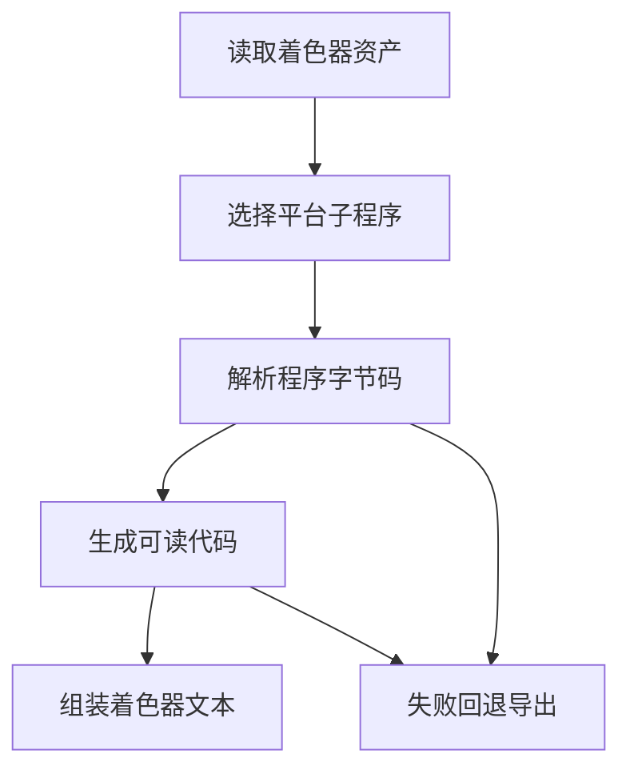

# Shader Decompilation 证据型可行性评估

日期：2026-05-25

## 结论

Shader Decompilation 可以做，但不是简单打开一个已有开关。当前公开仓库已经具备部分基础条件：有 Shader 导出模式枚举、有平台支持判断、有 Shader 导出管线，也能识别 DirectX 和 SPIR V 等程序类型。但公开代码中没有真正接入 Shader 反编译导出器，因此要实现页面描述的能力，需要新增一条完整的反编译流水线。

推荐判断：

* Vulkan 路线可行性较高，适合优先验证。核心原因是 Unity 中 Vulkan 通常对应 SPIR V，现有开源工具链对 SPIR V 解析、反射、交叉编译支持更成熟。
* DirectX 路线可行性中等偏高，但限制更多。Windows 限制合理，因为 DirectX 字节码处理、反射和相关工具链主要集中在 Windows 生态。
* 要达到页面描述的“支持所有变体并尽量保持完美语义”，工作量很高，不能按普通导出功能估算。

一句话评估：能做一个可用的实验性版本，但要做成稳定、语义完整、Unity Editor 高通过率的版本，属于长期迭代功能。

## 当前仓库证据

### 已有功能入口

`Source/AssetRipper.Export/Configuration/ShaderExportMode.cs` 已经定义了 `ShaderExportMode.Decompile`，注释说明目标是导出反编译后的 HLSL。

证据位置：

* `Source/AssetRipper.Export/Configuration/ShaderExportMode.cs:14`
* `Source/AssetRipper.Export/Configuration/ShaderExportMode.cs:16`

这说明配置层已经预留了反编译模式。

### 当前导出管线没有接入反编译器

`Source/AssetRipper.Export.UnityProjects/ProjectExporter.Overrides.cs` 中的 Shader 导出覆盖逻辑目前只在 `ShaderExportMode.Yaml` 时使用 `YamlShaderExporter`，其他情况都会回落到 `DummyShaderTextExporter`。随后又注册了 `SimpleShaderExporter`，它只适用于 Shader 资产本身已经包含可用源码的情况。

证据位置：

* `Source/AssetRipper.Export.UnityProjects/ProjectExporter.Overrides.cs:141`
* `Source/AssetRipper.Export.UnityProjects/ProjectExporter.Overrides.cs:144`
* `Source/AssetRipper.Export.UnityProjects/ProjectExporter.Overrides.cs:145`
* `Source/AssetRipper.Export.UnityProjects/ProjectExporter.Overrides.cs:147`

这说明公开仓库里还没有真正的 `Decompile` 导出实现。

### UI 支持状态判断已经存在

`Source/AssetRipper.GUI.Web/Pages/PremiumFeaturesPage.cs` 已经有 Shader Decompilation 的支持状态判断。判断条件是存在 Vulkan 平台，或 DirectX 平台且当前操作系统为 Windows。

证据位置：

* `Source/AssetRipper.GUI.Web/Pages/PremiumFeaturesPage.cs:24`
* `Source/AssetRipper.GUI.Web/Pages/PremiumFeaturesPage.cs:51`
* `Source/AssetRipper.GUI.Web/Pages/PremiumFeaturesPage.cs:53`

这与页面描述一致：Vulkan 可跨平台，DirectX 仅 Windows。

### 平台和程序类型基础已经存在

`Source/AssetRipper.SourceGenerated.Extensions/Enums/Shader/GpuProgramType/ShaderGpuProgramType.cs` 已经包含 DirectX、SPIR V、Metal、GL 等程序类型，并提供 DirectX 判断、GPU 平台映射、程序关键字映射等基础能力。

证据位置：

* `Source/AssetRipper.SourceGenerated.Extensions/Enums/Shader/GpuProgramType/ShaderGpuProgramType.cs:19`
* `Source/AssetRipper.SourceGenerated.Extensions/Enums/Shader/GpuProgramType/ShaderGpuProgramType.cs:25`
* `Source/AssetRipper.SourceGenerated.Extensions/Enums/Shader/GpuProgramType/ShaderGpuProgramType.cs:35`
* `Source/AssetRipper.SourceGenerated.Extensions/Enums/Shader/GpuProgramType/ShaderGpuProgramType.cs:81`
* `Source/AssetRipper.SourceGenerated.Extensions/Enums/Shader/GpuProgramType/ShaderGpuProgramType.cs:223`
* `Source/AssetRipper.SourceGenerated.Extensions/Enums/Shader/GpuProgramType/ShaderGpuProgramType.cs:294`

这说明实现反编译时，不需要从零开始识别所有 GPU 程序类型。

## 外部工具链可行性

### Vulkan 和 SPIR V

Vulkan Shader 通常以 SPIR V 形式存在。SPIRV Cross 是 KhronosGroup 维护的工具，定位是从 SPIR V 交叉编译到 GLSL、MSL、HLSL 等目标语言，并支持反射信息提取。SPIRV Tools 提供 SPIR V 的汇编、反汇编、验证和优化等基础工具。

因此，Vulkan 路线可以采用“SPIR V 解析和反射，再输出 HLSL 或可嵌入 ShaderLab 的代码”的思路。它不是原始源代码恢复，但可以产出接近语义的可读代码。

风险在于 Unity ShaderLab 不只包含单段程序代码，还包含 Properties、SubShader、Pass、Tags、RenderState、Keyword、Variant 等结构。SPIR V 工具只能解决程序体和资源绑定的一部分，完整 ShaderLab 仍要从 Unity 序列化数据中重建。

### DirectX

DirectX Shader 可能涉及 DXBC、DXIL 或不同 Shader Model 的字节码形态。DirectXShaderCompiler 主要围绕 HLSL 编译和 DXIL 生态，不等同于完整的 DXBC 到 HLSL 反编译器。DirectX 字节码的反射和反汇编可以帮助恢复资源绑定、入口点、输入输出语义等信息，但从字节码稳定生成高质量 HLSL 的难度明显高于 Vulkan SPIR V 路线。

页面限制 DirectX 只能在 Windows 计算机上反编译是合理的，因为 DirectX 相关编译器、反射接口和运行时生态更依赖 Windows。

### 直接接入现成完整反编译器

如果存在可复用的内部或第三方完整 Shader 反编译器，接入成本会显著降低。但公开仓库中没有看到相关模块或包引用。当前仓库状态更像是已经预留 UI 和配置入口，真实 Premium 版本可能通过派生 `ExportHandler` 或额外模块注入能力。

这意味着在公开仓库独立实现时，不能假设已有核心反编译器，只能按新增能力评估。

## 可行边界

短期可行：

* 识别 Shader 中可反编译的平台子程序。
* 优先处理 Vulkan SPIR V。
* 对 DirectX 只支持一部分常见 Shader Model。
* 在反编译失败时回退 Dummy Shader 或 Yaml Shader，避免整个导出失败。
* 在导出结果中保留原始平台、变体、关键字、错误原因等诊断信息。

中期可行：

* 提升 ShaderLab 包装质量。
* 恢复 Properties、Pass、Tags、RenderState 和资源绑定。
* 建立样本库，覆盖 Unity 不同版本和不同平台。
* 增加 Unity Editor 编译验证闭环。

长期困难：

* 支持所有 Shader 变体。
* 完美保留语义。
* 让大多数复杂 Shader 在 Unity Editor 中直接编译通过。
* 对 Metal、GL、主机平台、RayTracing 等程序类型提供同级别支持。

## 主要风险

### 语义恢复风险

字节码反编译通常无法恢复原始变量名、宏结构、include 结构、用户注释和高级源代码组织。它更像从压缩后的成品中还原一份近似说明书，而不是找回原始设计稿。

### Unity ShaderLab 重建风险

Unity Shader 不只是 GPU 程序体。即便程序体能反编译出来，也需要正确重建 ShaderLab 的外壳结构，否则 Unity Editor 仍可能编译失败。

### 变体数量风险

Unity Shader 可能包含大量 keyword 变体和多平台子程序。全部反编译会带来明显的性能、体积和错误处理压力。

### 跨平台依赖风险

Vulkan 工具链相对跨平台。DirectX 相关处理如果依赖 Windows SDK 或原生库，会增加发布和运行环境复杂度。

### 法务和许可证风险

如果引入第三方工具或原生库，需要逐项确认许可证是否兼容当前项目的 GPL 3 许可证，并在 `Source/Licenses` 中补充声明。

## 工作量评估

按公开仓库从零补齐估算：

* 技术验证版本：2 到 4 周。目标是证明 Vulkan SPIR V 可提取、可转换、可写回 ShaderLab，并具备失败回退。
* 可用实验版本：1 到 2 个月。目标是覆盖常见 Unity Shader，增加错误诊断和部分 DirectX 支持。
* 稳定可维护版本：3 到 6 个月以上。目标是建立样本库、回归验证、Unity Editor 编译检查和多版本适配。
* 接近页面描述的完整语义目标：长期迭代，不适合承诺固定周期。

## 推荐结论

建议把 Shader Decompilation 作为实验性功能分阶段推进，而不是一次性承诺完整功能。

第一阶段只验证 Vulkan SPIR V，原因是工具链成熟、跨平台能力更好、与页面描述一致。第二阶段再评估 DirectX，优先 Windows。所有阶段都必须保留 Dummy 或 Yaml 回退，避免反编译失败破坏整体导出流程。

如果只是想验证“能不能做”，答案是能。如果目标是“高成功率恢复 Unity 可编译 ShaderLab”，则需要投入专门的 Shader 反编译和 Unity 序列化适配工作，不能按普通导出器功能估算。

## 类比理解

这个需求像从已经烤好的蛋糕里还原配方。Vulkan SPIR V 和 DirectX 字节码就像蛋糕的成品切片，能分析出用了面粉、糖、奶油，也能大致推断步骤。但原始配方里的品牌、注释、厨师习惯、摆盘意图，很难百分百恢复。

AssetRipper 当前仓库已经有菜单、点单入口和一部分食材识别能力，但真正负责“反推配方再写成 Unity ShaderLab”的厨房工位还没有接上。

## 参考流程

## 引用说明

* AssetRipper Premium Features 原始页面：https://assetripper.github.io/AssetRipper/articles/PremiumFeatures.html
* AssetRipper 当前仓库文档：`docs/articles/PremiumFeatures.md`
* KhronosGroup SPIRV Cross：https://github.com/KhronosGroup/SPIRV-Cross
* KhronosGroup SPIRV Tools：https://github.com/KhronosGroup/SPIRV-Tools
* Microsoft DirectXShaderCompiler：https://github.com/microsoft/DirectXShaderCompiler
* UnityCsReference ShaderCompilerData：https://github.com/Unity-Technologies/UnityCsReference/blob/master/Editor/Mono/Graphics/ShaderCompilerData.cs
