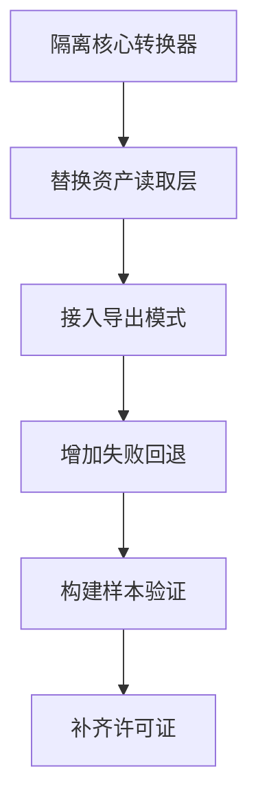

# USCSandbox Shader 反编译逻辑移植分析

日期：2026-05-25

## 结论

`3rdParties/USCSandbox` 里确实有 Shader 反编译相关逻辑，而且不是空壳。它包含一条从 Unity Shader 资产读取平台数据、解压 blob、解析子程序、把 DirectX 或 Switch NVN 程序转换为中间表示，再输出 HLSL 和 ShaderLab 文本的实验性流水线。

可移植性判断：

* 可以移植一部分，尤其是 DirectX DXBC 到 HLSL 的路径。
* 不建议整体复制控制台工具，应抽取核心转换器并重写 AssetRipper 适配层。
* 它不能直接满足 Premium 页面中的 Vulkan 支持，因为当前没有看到 SPIR V 到 HLSL 的实际处理链。
* 它也不能直接覆盖全部 DirectX 需求，当前主流程主要选择 DX11 SM40 顶点和片元程序，SM50 只在部分元数据判断中出现，尚未在 ShaderProcessor 的 DirectX 输出分支完整启用。

一句话结论：USCSandbox 可以作为 AssetRipper Shader Decompilation 的 DirectX 原型来源，但需要清理、适配、补测试和许可证核验后才能进入主项目。

## 代码证据

### 项目定位

`readme.md` 写明该项目是 AssetRipper USC 的 headless rework。

证据位置：

* `3rdParties/USCSandbox/readme.md`

项目是 `net8.0` 控制台程序，并直接引用多个本地 DLL：

* `AssetsTools.NET.dll`
* `AssetRipper.Primitives.dll`
* `Ryujinx.Graphics.Shader.dll`
* `Ryujinx.ShaderTools.dll`
* `Spv.Generator.dll`

证据位置：

* `3rdParties/USCSandbox/USCSandbox/USCSandbox.csproj`

这说明它是独立实验工具，不是当前主项目的正常模块。

### 命令行入口

`Program.cs` 支持从 bundle 或 assets 文件中读取 Shader，默认平台是 `d3d11`，可通过 `--platform` 指定 `d3d11` 或 `Switch`。读取到 Shader 后会创建 `ShaderProcessor` 并调用 `Process()`，最后写出 `.shader` 文件。

证据位置：

* `3rdParties/USCSandbox/USCSandbox/Program.cs:14`
* `3rdParties/USCSandbox/USCSandbox/Program.cs:25`
* `3rdParties/USCSandbox/USCSandbox/Program.cs:166`
* `3rdParties/USCSandbox/USCSandbox/Program.cs:167`
* `3rdParties/USCSandbox/USCSandbox/Program.cs:170`

这条入口证明它不是单纯反汇编，而是能生成 ShaderLab 文本文件。

### Unity Shader 数据读取

`ShaderProcessor.Process()` 会读取：

* `m_ParsedForm`
* `m_Name`
* `m_KeywordNames`
* `platforms`
* `offsets`
* `compressedLengths`
* `decompressedLengths`
* `compressedBlob`

随后用 LZ4 解压 blob，交给 `BlobManager` 读取子数据。

证据位置：

* `3rdParties/USCSandbox/USCSandbox/Processor/ShaderProcessor.cs:32`
* `3rdParties/USCSandbox/USCSandbox/Processor/ShaderProcessor.cs:36`
* `3rdParties/USCSandbox/USCSandbox/Processor/ShaderProcessor.cs:40`
* `3rdParties/USCSandbox/USCSandbox/Processor/ShaderProcessor.cs:42`
* `3rdParties/USCSandbox/USCSandbox/Processor/ShaderProcessor.cs:63`
* `3rdParties/USCSandbox/USCSandbox/Processor/ShaderProcessor.cs:67`

注意：代码里会写出 `dbg_entry_*.bin` 和 `dbg_entry_data_*.bin` 调试文件，这不能直接带入主项目。

证据位置：

* `3rdParties/USCSandbox/USCSandbox/Processor/ShaderProcessor.cs:71`
* `3rdParties/USCSandbox/USCSandbox/Processor/ShaderProcessor.cs:207`

### ShaderLab 包装能力

`ShaderProcessor` 会写出：

* `Shader "名称" {}`
* `Properties`
* `SubShader`
* `Tags`
* `LOD`
* `Pass`
* `Name`
* RenderState
* `CGPROGRAM`
* `#pragma vertex vert`
* `#pragma fragment frag`
* `ENDCG`

证据位置：

* `3rdParties/USCSandbox/USCSandbox/Processor/ShaderProcessor.cs:74`
* `3rdParties/USCSandbox/USCSandbox/Processor/ShaderProcessor.cs:77`
* `3rdParties/USCSandbox/USCSandbox/Processor/ShaderProcessor.cs:78`
* `3rdParties/USCSandbox/USCSandbox/Processor/ShaderProcessor.cs:94`
* `3rdParties/USCSandbox/USCSandbox/Processor/ShaderProcessor.cs:123`
* `3rdParties/USCSandbox/USCSandbox/Processor/ShaderProcessor.cs:129`
* `3rdParties/USCSandbox/USCSandbox/Processor/ShaderProcessor.cs:339`
* `3rdParties/USCSandbox/USCSandbox/Processor/ShaderProcessor.cs:443`
* `3rdParties/USCSandbox/USCSandbox/Processor/ShaderProcessor.cs:523`
* `3rdParties/USCSandbox/USCSandbox/Processor/ShaderProcessor.cs:559`
* `3rdParties/USCSandbox/USCSandbox/Processor/ShaderProcessor.cs:608`

这部分对 AssetRipper 很有价值，因为它不只是输出函数体，还尝试重建 Unity ShaderLab 外壳。

### DirectX 转换链

DirectX 主流程在 `ShaderProcessor.WritePassBody()` 中：

1. 找到 DX11 顶点或片元子程序。
2. 创建 `USCShaderConverter`。
3. `LoadDirectXCompiledShader()` 读取 DirectX 编译后数据。
4. `ConvertDxShaderToUShaderProgram()` 转成 USIL 中间表示。
5. `ApplyMetadataToProgram()` 应用 Unity Shader 参数和优化。
6. `UShaderFunctionToHLSL` 输出 HLSL 结构和函数。

证据位置：

* `3rdParties/USCSandbox/USCSandbox/Processor/ShaderProcessor.cs:275`
* `3rdParties/USCSandbox/USCSandbox/Processor/ShaderProcessor.cs:277`
* `3rdParties/USCSandbox/USCSandbox/Processor/ShaderProcessor.cs:278`
* `3rdParties/USCSandbox/USCSandbox/Processor/ShaderProcessor.cs:280`
* `3rdParties/USCSandbox/USCSandbox/Processor/ShaderProcessor.cs:281`
* `3rdParties/USCSandbox/USCSandbox/Processor/ShaderProcessor.cs:282`
* `3rdParties/USCSandbox/USCSandbox/Processor/ShaderProcessor.cs:283`
* `3rdParties/USCSandbox/USCSandbox/Processor/ShaderProcessor.cs:285`
* `3rdParties/USCSandbox/USCSandbox/Processor/ShaderProcessor.cs:290`
* `3rdParties/USCSandbox/USCSandbox/Processor/ShaderProcessor.cs:292`

`USCShaderConverter` 负责识别 Unity DirectX 数据头偏移，并包装 `DirectXCompiledShader`。

证据位置：

* `3rdParties/USCSandbox/USCSandbox/UltraShaderConverter/Converter/USCShaderConverter.cs:23`
* `3rdParties/USCSandbox/USCSandbox/UltraShaderConverter/Converter/USCShaderConverter.cs:30`
* `3rdParties/USCSandbox/USCSandbox/UltraShaderConverter/Converter/USCShaderConverter.cs:101`
* `3rdParties/USCSandbox/USCSandbox/UltraShaderConverter/Converter/USCShaderConverter.cs:154`

`DirectXCompiledShader` 解析 DXBC 容器里的 `ISGN`、`OSGN`、`SHDR`、`SHEX` 块。

证据位置：

* `3rdParties/USCSandbox/USCSandbox/UltraShaderConverter/DirectXDisassembler/DirectXCompiledShader.cs`

`DirectXProgramToUSIL` 支持大量 DX 指令到 USIL 的映射，遇到未支持的非声明指令会写成注释并标记 Unsupported。

证据位置：

* `3rdParties/USCSandbox/USCSandbox/UltraShaderConverter/UShader/DirectX/DirectXProgramToUSIL.cs:31`
* `3rdParties/USCSandbox/USCSandbox/UltraShaderConverter/UShader/DirectX/DirectXProgramToUSIL.cs:127`
* `3rdParties/USCSandbox/USCSandbox/UltraShaderConverter/UShader/DirectX/DirectXProgramToUSIL.cs:134`
* `3rdParties/USCSandbox/USCSandbox/UltraShaderConverter/UShader/DirectX/DirectXProgramToUSIL.cs:157`

### Switch NVN 转换链

代码中还有 Switch NVN 路线，会通过 Ryujinx Shader 翻译器读取 Nintendo Switch 图形程序，并转换为同一套 USIL 中间表示，再输出 HLSL。

证据位置：

* `3rdParties/USCSandbox/USCSandbox/Processor/ShaderProcessor.cs:296`
* `3rdParties/USCSandbox/USCSandbox/Processor/ShaderProcessor.cs:300`
* `3rdParties/USCSandbox/USCSandbox/Processor/ShaderProcessor.cs:301`
* `3rdParties/USCSandbox/USCSandbox/UltraShaderConverter/Converter/USCShaderConverter.cs:50`
* `3rdParties/USCSandbox/USCSandbox/UltraShaderConverter/Converter/USCShaderConverter.cs:115`

限制是旧格式直接抛出不支持。

证据位置：

* `3rdParties/USCSandbox/USCSandbox/UltraShaderConverter/Converter/USCShaderConverter.cs:96`

### HLSL 输出链

`UShaderFunctionToHLSL` 把 USIL 输出为 HLSL。它能写 `appdata`、`v2f`、`fout` 结构，也能输出 `vert` 和 `frag` 函数，并处理采样、分支、循环、比较、数学运算等多类指令。

证据位置：

* `3rdParties/USCSandbox/USCSandbox/UltraShaderConverter/UShader/Function/UShaderFunctionToHLSL.cs:25`
* `3rdParties/USCSandbox/USCSandbox/UltraShaderConverter/UShader/Function/UShaderFunctionToHLSL.cs:103`
* `3rdParties/USCSandbox/USCSandbox/UltraShaderConverter/UShader/Function/UShaderFunctionToHLSL.cs:145`
* `3rdParties/USCSandbox/USCSandbox/UltraShaderConverter/UShader/Function/UShaderFunctionToHLSL.cs:515`
* `3rdParties/USCSandbox/USCSandbox/UltraShaderConverter/UShader/Function/UShaderFunctionToHLSL.cs:623`

不过这个输出器里也有明确的临时处理和未完成注释，例如位移处理标注为不准确，结构化资源加载也标注了 todo。

证据位置：

* `3rdParties/USCSandbox/USCSandbox/UltraShaderConverter/UShader/Function/UShaderFunctionToHLSL.cs:443`
* `3rdParties/USCSandbox/USCSandbox/UltraShaderConverter/UShader/Function/UShaderFunctionToHLSL.cs:478`
* `3rdParties/USCSandbox/USCSandbox/UltraShaderConverter/UShader/Function/UShaderFunctionToHLSL.cs:625`

## 支持范围判断

当前看起来支持：

* Unity Shader 资产中 `m_ParsedForm` 结构的读取。
* 压缩 blob 解包。
* DXBC 的 `SHDR` 和 `SHEX` 程序块解析。
* DX11 SM40 顶点和片元程序的主流程输出。
* Switch NVN 顶点和片元程序的实验性输出。
* 基础 Properties、SubShader、Pass 和 RenderState 重建。
* 一部分 keyword variant 输出。

当前没有看到支持：

* Vulkan SPIR V 到 HLSL 的完整转换路径。
* DXIL 容器和 DXIL 指令级反编译。
* DX9 主流程。
* Geometry、Hull、Domain、Compute、RayTracing 的完整输出。
* DirectX SM50 在 `ShaderProcessor` 主输出分支中的完整启用。
* Unity Editor 编译结果验证。
* 失败时回退 Dummy 或 Yaml 的主项目级错误处理。

## 构建验证

执行：

```powershell
dotnet build 3rdParties\USCSandbox\USCSandbox.sln
```

结果：

* 构建成功。
* 0 个错误。
* 27 个警告。

典型警告包括：

* nullable 字段未初始化。
* 潜在空引用。
* `ShaderProcessor` 中平台 switch 表达式不穷举。

这说明代码可编译，但质量状态仍是实验性，移植前必须整理异常边界。

## 与当前 AssetRipper 的关系

当前 AssetRipper 公开仓库中已经有 `ShaderExportMode.Decompile` 枚举，但导出管线没有真正接入 Shader 反编译器。此前分析过的证据是：

* `Source/AssetRipper.Export/Configuration/ShaderExportMode.cs` 定义了 `Decompile`。
* `Source/AssetRipper.Export.UnityProjects/ProjectExporter.Overrides.cs` 中 Shader 导出仍然只在 Yaml 和 Dummy 之间切换，并额外注册 `SimpleShaderExporter`。

USCSandbox 正好补上了缺失的核心方向：从编译后 Shader 程序生成 HLSL 和 ShaderLab。但它使用 AssetsTools.NET 的 `AssetTypeValueField`，而当前主项目有自己的 SourceGenerated 类型系统。因此移植重点不是复制 `ShaderProcessor`，而是把其思路改造成 AssetRipper 原生对象适配器。

## 推荐移植策略

### 不建议整体移植

不建议把整个 `USCSandbox` 工具直接并入主项目，原因是：

* 它是控制台工具，不是 AssetRipper 导出模块。
* 它依赖 `AssetsTools.NET` 读取资产，与主项目的资产模型重复。
* 它会写调试二进制文件。
* 它的命名空间混杂了 `USCSandbox` 和 `AssetRipper.Export.Modules.Shaders.UltraShaderConverter`。
* 它没有本地 LICENSE 文件，需要先确认移植许可。

### 建议抽取核心

建议抽取以下模块作为候选：

* `UltraShaderConverter/DirectXDisassembler`
* `UltraShaderConverter/UShader/DirectX`
* `UltraShaderConverter/UShader/Function`
* `UltraShaderConverter/USIL`
* 必要的 `USIL/Fixers`
* 必要的 `USIL/Optimizers`
* 必要的 `USIL/Metadders`

这些是更接近反编译核心的部分。

### 建议重写适配层

建议重写或替换以下部分：

* `Program.cs`
* `ShaderProcessor.cs`
* `BlobManager.cs`
* `SerializedProgramInfo.cs`
* `ShaderSubProgram.cs`
* `ShaderParams.cs`

这些类目前强依赖 `AssetsTools.NET` 和 `AssetTypeValueField`，应改为读取 AssetRipper 的 `IShader`、`ISerializedPass`、`ISerializedProgram`、`ISerializedSubProgram`、`ISerializedPlayerSubProgram` 等对象。

### 建议落点

主项目里更合适的落点是新增一个 Shader 导出器，例如：

* `Source/AssetRipper.Export.UnityProjects/Shaders/DecompiledShaderExporter.cs`
* 或新增独立模块 `AssetRipper.Export.Modules.Shaders`

导出管线应在 `ShaderExportMode.Decompile` 时优先尝试反编译，失败时回退到 Dummy 或 Yaml，并记录清晰日志。

## 移植流程建议



## 风险点

### 许可证风险

本地 `USCSandbox` 目录没有发现 LICENSE 文件。依赖 DLL 也需要逐个确认许可证，包括 AssetsTools.NET、Ryujinx、Spv.Generator 等。当前主项目是 GPL 3，移植前必须确认兼容性。

### 代码质量风险

虽然能构建成功，但有 27 个警告。部分代码中存在临时处理、todo、未穷举 switch、潜在空引用。这些都不适合直接进入主项目。

### 支持范围风险

USCSandbox 对 Vulkan 没有实际贡献。它对 DirectX 的贡献主要在 DXBC 路线，不覆盖 DXIL。对于 Premium 页面里的“Vulkan 任意平台、DirectX Windows”目标，它只能解决一部分 DirectX。

### 数据模型风险

USCSandbox 使用 AssetsTools.NET 的字段访问方式，主项目使用 SourceGenerated 类型。字段结构相似，但不能机械复制，需要逐项对齐 Unity 版本差异。

### 输出质量风险

反编译输出可能能读，但不一定能在 Unity Editor 中稳定编译。`UShaderFunctionToHLSL` 内部已有不准确和未完成处理的注释，这意味着需要样本回归和错误回退。

## 工作量评估

DirectX 原型移植：

* 预计 3 到 7 天。
* 目标是把 DXBC 到 HLSL 的核心链路接入 AssetRipper 导出器，并能在少量样本上导出。

DirectX 可用实验版：

* 预计 2 到 4 周。
* 目标是移除 AssetsTools.NET 依赖、清理调试文件、完善日志、处理失败回退、覆盖常见 Unity Shader。

更完整版本：

* 预计 1 到 3 个月以上。
* 目标是补 SM50、更多 Shader 阶段、Unity Editor 编译验证和样本库。

Vulkan 支持：

* USCSandbox 当前不能直接提供。
* 仍需要单独设计 SPIR V 路线，例如 SPIRV Cross 或其他工具链。

## 推荐结论

可以移植，但应按“移植 DirectX 反编译核心”处理，而不是按“直接搬一个完整 Shader Decompilation 功能”处理。

推荐顺序：

1. 先做许可证核验。
2. 抽出 DirectXDisassembler、USIL、DirectXProgramToUSIL、UShaderFunctionToHLSL。
3. 重写 AssetRipper 原生适配层。
4. 接入 `ShaderExportMode.Decompile`。
5. 所有异常都回退 Dummy Shader。
6. 用真实 Unity Shader 样本验证导出和 Unity Editor 编译。
7. Vulkan 另起路线，不依赖 USCSandbox。

## 类比理解

USCSandbox 像一个能跑通的小作坊：它已经能把一部分 DirectX Shader 原料拆开、整理、再做成 Unity 可以尝试读取的 ShaderLab 成品。但它的传送带、包装箱和仓库接口都按自己的小作坊方式设计。

AssetRipper 主项目像正式工厂。能借用的是小作坊里的核心机器，也就是 DirectX 解析、USIL 中间表示和 HLSL 输出器；不能直接搬的是整条传送带，因为资产读取、日志、错误回退、导出策略和许可证要求都不同。

## 引用说明

* USCSandbox 本地目录：`3rdParties/USCSandbox`
* USCSandbox 远程仓库：https://github.com/nesrak1/USCSandbox
* USCSandbox 项目文件：`3rdParties/USCSandbox/USCSandbox/USCSandbox.csproj`
* USCSandbox 命令行入口：`3rdParties/USCSandbox/USCSandbox/Program.cs`
* ShaderProcessor：`3rdParties/USCSandbox/USCSandbox/Processor/ShaderProcessor.cs`
* USCShaderConverter：`3rdParties/USCSandbox/USCSandbox/UltraShaderConverter/Converter/USCShaderConverter.cs`
* DirectXCompiledShader：`3rdParties/USCSandbox/USCSandbox/UltraShaderConverter/DirectXDisassembler/DirectXCompiledShader.cs`
* DirectXProgramToUSIL：`3rdParties/USCSandbox/USCSandbox/UltraShaderConverter/UShader/DirectX/DirectXProgramToUSIL.cs`
* UShaderFunctionToHLSL：`3rdParties/USCSandbox/USCSandbox/UltraShaderConverter/UShader/Function/UShaderFunctionToHLSL.cs`
