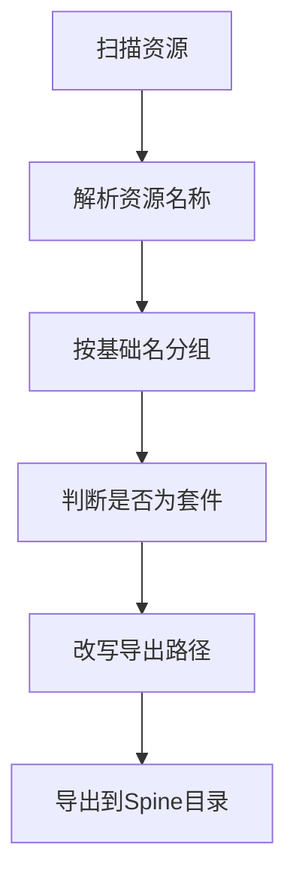

# Spine 资源导出整理设计

## 背景

当前导出 Unity 工程时，Spine 相关资源会按原始容器路径或默认资源类型目录分散输出。用户希望在提取阶段识别同名 Spine 套件，例如 `小红.png`、`小红.json`、`小红.skel.bytes`、`小红.atlas.txt`，并统一放到导出工程的 `Assets/Spine` 目录下，不再按角色名创建子目录。

## 目标

- 识别同名 Spine 资源组。
- 将识别到的 Spine 贴图和骨骼描述文件统一导出到 `Assets/Spine`。
- 保留文件名语义，例如 `小红.atlas.txt` 和 `小红.skel.bytes`。
- 不影响非 Spine 资源的原有导出路径。

## 识别规则

按基础名分组。以下文件视为同一组：

- `小红.png`
- `小红.json`
- `小红.skel.bytes`
- `小红.atlas.txt`

资源类型映射：

- `Texture2D` 贴图资源匹配基础名 `小红`。
- `TextAsset` 资源匹配 `小红.json`、`小红.skel.bytes`、`小红.atlas.txt`。

一组资源至少包含贴图和任意一种 Spine 描述文件时，认为是 Spine 套件。

## 导出路径

识别成功后统一设置导出覆盖路径：

```text
Assets/Spine
```

示例：

```text
Assets/Spine/小红.png
Assets/Spine/小红.json
Assets/Spine/小红.skel.bytes
Assets/Spine/小红.atlas.txt
```

## 流程图



## 类比理解

可以把 Spine 资源看成一套角色拼图：贴图是彩色图片，json 或 skel 是骨架说明，atlas 是图片裁切说明。原本这些拼图块可能散落在不同抽屉里；新逻辑会先确认它们属于同一套角色，再统一放进 `Assets/Spine` 这个抽屉，方便 Unity 项目里后续直接整理和使用。

## 引用说明

- 本地代码：`Source/AssetRipper.Processing/Scenes/OriginalPathProcessor.cs`
- 本地代码：`Source/AssetRipper.Export.UnityProjects/Paths/ExportPathResolver.cs`
- 本地代码：`Source/AssetRipper.Export.UnityProjects/Miscellaneous/TextAssetExportCollection.cs`
- 本地代码：`Source/AssetRipper.Export.UnityProjects/Textures/TextureExportCollection.cs`

